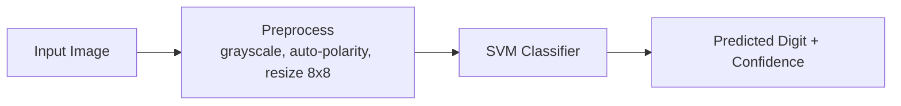

# Handwritten Digit Classifier

[](#requirements)
[](#quick-start-uv)
[](#how-it-works)

Professional, lightweight Python CLI to identify handwritten digits from image files.

## Workflow Overview



## What This Project Does

- Trains a handwritten-digit classifier (0-9).
- Predicts the number shown in a provided image.
- Automatically trains a model if one is not available.
- Exports real handwritten sample images from a public OpenML source.

## Project Layout

```text
handwrittenpics/
	main.py
	pyproject.toml
	README.md
	requirements.txt
	tools/
		download_openml_samples.py
	models/
		digit_model.pkl          # generated after training
	sample_images/
		openml_mnist/            # generated by downloader script
```

## Requirements

- Python 3.9+
- uv (https://docs.astral.sh/uv/)

## Quick Start (uv)

1. Create a virtual environment:

```bash
uv venv
```

2. Install dependencies from project metadata:

```bash
uv sync
```

3. Train the model:

```bash
uv run python main.py train
```

4. Predict from an image:

```bash
uv run python main.py predict path/to/your_image.png
```

Example output:

```text
Predicted digit: 7
Confidence score: 0.94xx
```

## Open Source Handwritten Images

This project includes a helper script that downloads sample handwritten images from the public OpenML MNIST dataset.

Source:
- OpenML dataset: `mnist_784`
- Public reference: https://www.openml.org/d/554

Download sample images:

```bash
uv run python tools/download_openml_samples.py --per-digit 2
```

This creates PNG files in `sample_images/openml_mnist/`, for example:

- `sample_images/openml_mnist/digit_0_1.png`
- `sample_images/openml_mnist/digit_7_2.png`

Run a prediction on one of them:

```bash
uv run python main.py predict sample_images/openml_mnist/digit_7_2.png
```

## How It Works

1. Training data comes from scikit-learn digits dataset (8x8 grayscale).
2. Model pipeline: `StandardScaler` + `SVC` (RBF kernel).
3. Input image preprocessing:
- grayscale conversion
- inversion
- resize to 8x8
- normalization to training scale (0-16)

## Quality Tips

- Provide one centered digit per image.
- Keep contrast high between foreground and background.
- Avoid clutter, noise, and multiple digits in one frame.

## License

Educational and personal-use friendly. Add a formal LICENSE file if you plan to distribute.
